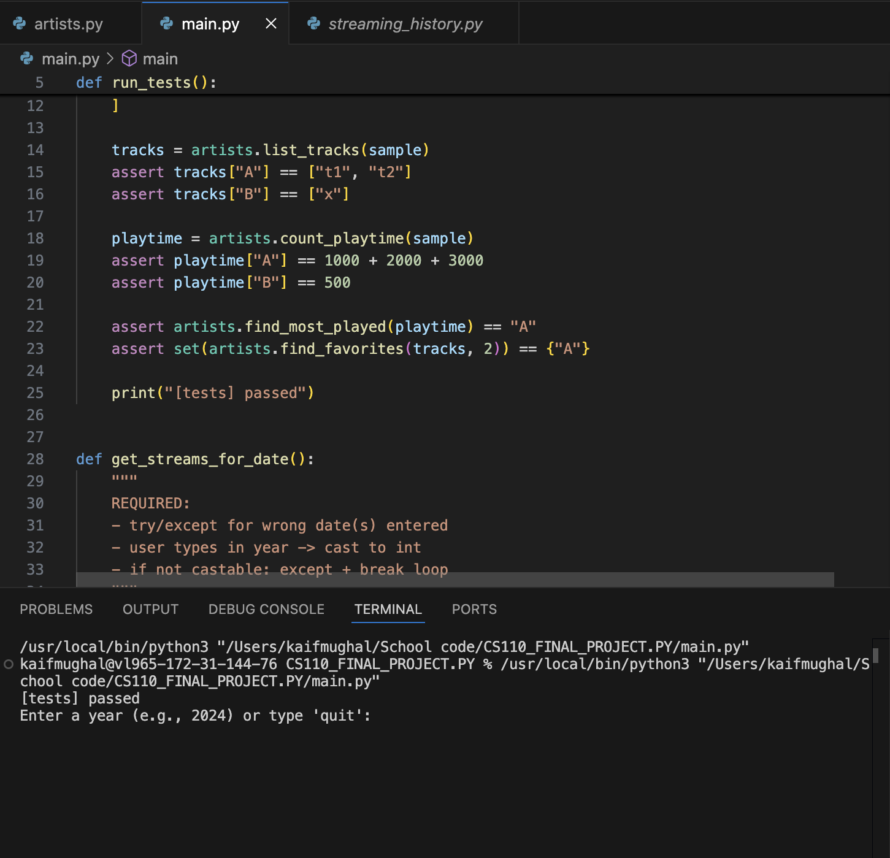

# spotify-listening-analysis

A lightweight Python pipeline that parses Spotify Streaming History exports and generates clean listening insights + artist-level summaries.

## What it does
- Ingests Spotify Streaming History data (JSON/CSV export)
- Cleans + normalizes play events (time, artist, track)
- Produces summary tables for top artists, listening trends, and engagement patterns

## Repository structure
- `main.py` — entry point (runs the analysis)
- `streaming_history.py` — parsing + cleaning helpers
- `artists.py` — artist-level aggregation + summaries

## How to run
> Requires Python 3.10+
> ## Sample output


1. Clone:
```bash
git clone https://github.com/<your-username>/spotify-listening-analysis.git
cd spotify-listening-analysis
```

2. (Optional) Create a virtual environment:
```bash
python -m venv .venv
source .venv/bin/activate   # mac/linux
# .venv\Scripts\activate    # windows
```

3. Install dependencies (if needed):
```bash
pip install -r requirements.txt
```

4. Run:
```bash
python main.py
```


